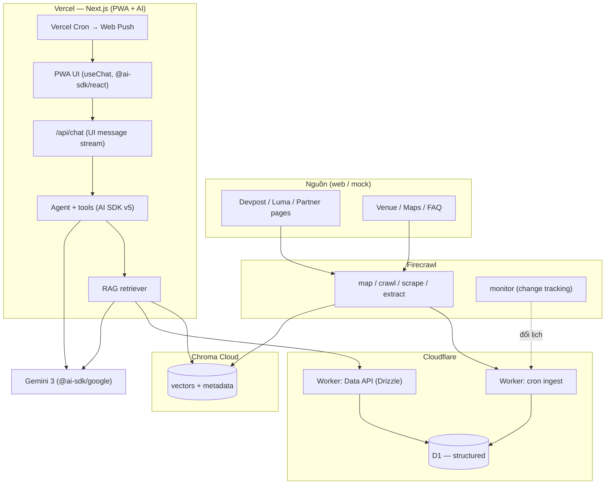
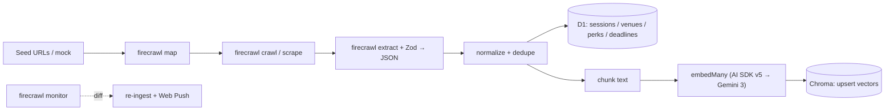
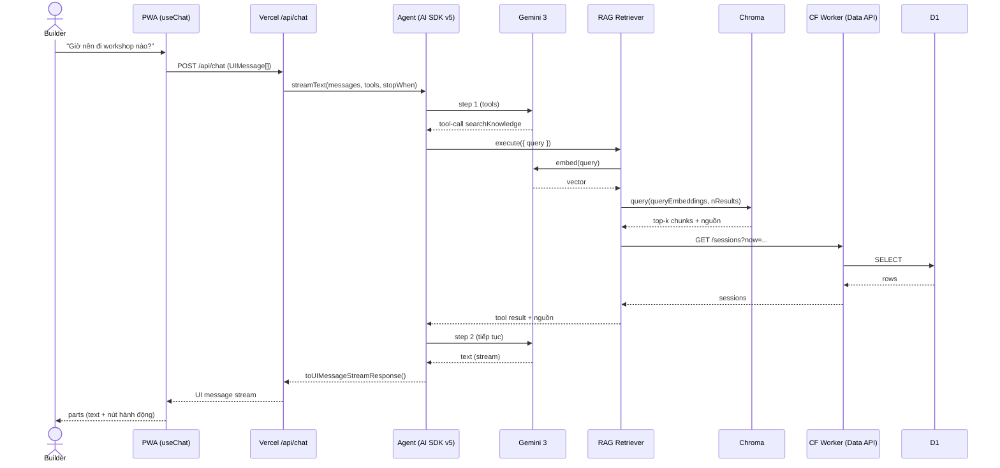
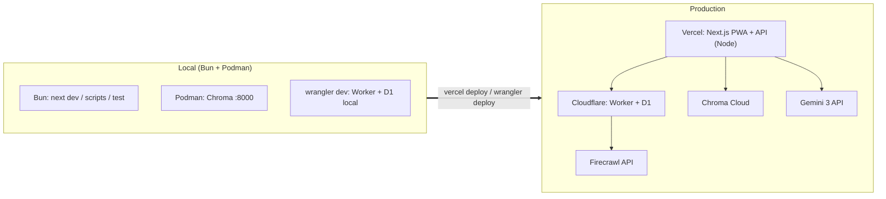
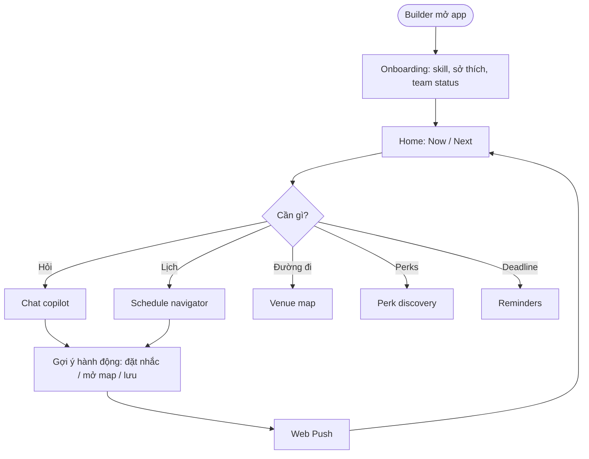
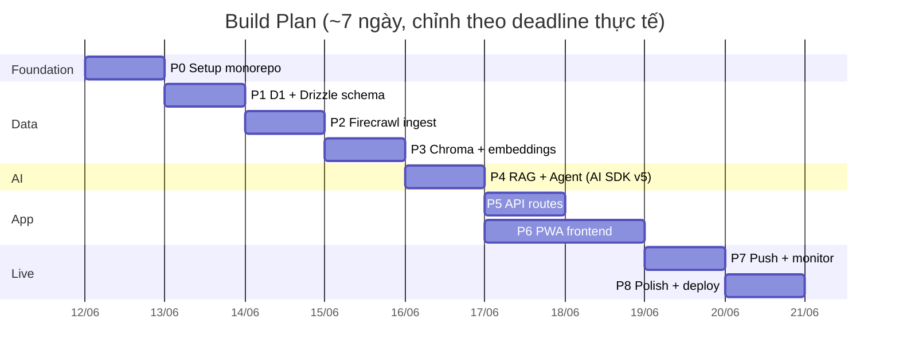
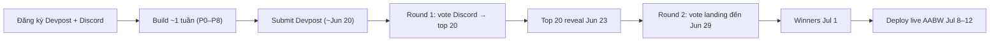

# Event Copilot — Build Plan (chi tiết)

> **Track:** Builder Experience Award — Agentic AI Build Week (Jul 8–12, HCMC)
> **Concept:** Event Copilot — trợ lý real-time trả lời *"đang có gì, ở đâu, tôi nên làm gì tiếp"*; tổng hợp lịch / workshop / venue / perk / deadline và **gợi ý hành động** (đặt nhắc, mở map, lưu).
> **Platform:** Web app PWA, mobile-first. **AI:** Hybrid RAG + Agent.
> **Stack chốt:** Bun (toolchain) · Firecrawl (ingest) · **Cloudflare D1** (structured) · **Chroma** (vector) · **Vercel AI SDK v5 + Gemini 3** (`@ai-sdk/google`, LLM + embeddings) · **Podman** (local dev) · **Vercel** (deploy).
>
> ✅ Code tích hợp dưới đây đã được **đối chiếu tài liệu chính chủ qua Context7**: AI SDK **v5** (`/vercel/ai` @ ai_5_0_0), **Gemini 3** (ai.google.dev), Cloudflare **D1** REST, **Chroma** JS client.

---

## 0. TL;DR — quyết định kiến trúc & các "tension" cần biết trước

Stack bạn chọn rất hay nhưng có vài điểm va chạm về runtime. Tôi đã chốt hướng xử lý rõ ràng để không vỡ trận giữa chừng:

| Tension | Sự thật | Hướng xử lý (chốt) |
|---|---|---|
| **Bun ↔ Vercel** | Vercel Functions chạy **Node.js/Edge runtime**, không chạy Bun làm server runtime | Dùng **Bun làm toolchain** (install, scripts, `bun test`, dev local). App deploy trên Vercel chạy **Node runtime**. `bun run dev` vẫn chạy Next bình thường. |
| **D1 ↔ Vercel** | D1 gắn chặt với Cloudflare Workers (binding). REST API có nhưng **dính global rate limit**, CF khuyến cáo chỉ cho admin | **Option A (khuyến nghị):** 1 **Worker mỏng** (D1 binding + Drizzle + cron ingest) làm Data API; Vercel gọi vào. **Option B (MVP nhanh):** gọi thẳng **D1 REST API** từ Vercel route. |
| **Chroma ↔ serverless** | Chroma cần server đang chạy, không nhúng in-process trên Vercel | **Prod:** `CloudClient()` → **Chroma Cloud**. **Local:** chạy Chroma server bằng **Podman**. |
| **Podman ↔ Vercel** | Vercel **không deploy container**, build từ source | Podman dùng cho **local dev** (Chroma, môi trường tái lập, integration test), **không** phải artifact deploy lên Vercel. |
| **AI SDK v5 ↔ v4** | v5 đổi API: `tool({inputSchema})`, `stopWhen: stepCountIs()`, `toUIMessageStreamResponse()`, `useChat` từ `@ai-sdk/react` + message `parts` | Dùng **toàn bộ AI SDK v5** (xem mục 10.1). Provider Gemini 3 = **`@ai-sdk/google`**. |
| **Gemini 3 thinking** | Gemini 3 bật *dynamic thinking*, mặc định `thinkingLevel: "high"` | Copilot cần nhanh → set `thinkingLevel: "low"` cho hỏi đáp ngắn; nâng `high` cho tác vụ lập kế hoạch phức tạp. |

> 🟢 **Phân chia nền tảng theo thế mạnh:** Cloudflare = dữ liệu + cron ingest (D1 + Worker). Vercel = PWA + AI (chat/agent, RAG). Chroma Cloud = vector. Gemini 3 = model (qua AI SDK v5). Firecrawl = nguồn dữ liệu.

> ⏱️ **Deadline rất sát (~Jun 20).** Nhãn ưu tiên: 🔴 bắt buộc demo · 🟡 nên có · 🟢 stretch. Gấp thì chạy **Option B** (all-Vercel, D1 REST) cho nhanh, thắng rồi nâng lên Option A.

---

## 1. Tech Stack (đã cập nhật)

| Layer | Lựa chọn | Vì sao | Ghi chú |
|---|---|---|---|
| Toolchain | **Bun** | install/scripts/test nhanh, native TS | Server prod chạy Node trên Vercel |
| App framework | **Next.js (App Router)** | All-in-one PWA + API routes + streaming, hạng nhất trên Vercel | Alt: Hono + Vite nếu muốn tách |
| UI | **Tailwind + shadcn/ui** | đẹp nhanh, accessible, mobile-first | |
| PWA | **Serwist** (`@serwist/next`) | service worker + offline + installable cho Next | Alt: next-pwa |
| **AI framework** | **Vercel AI SDK v5** (`ai` + `@ai-sdk/react`) | `streamText`, tools, `useChat`, streaming chuẩn cho Hybrid RAG+Agent | dùng **toàn bộ** v5 |
| **LLM + embeddings** | **Gemini 3** qua **`@ai-sdk/google`** | flagship mới, thinking config; embeddings cùng provider | chat `gemini-3-pro-preview` / `gemini-3-flash`; embed `gemini-embedding-001` |
| Structured DB | **Cloudflare D1** | SQLite serverless, hợp lịch/venue/perk | Truy cập qua Worker (A) hoặc REST (B) |
| ORM/migrations | **Drizzle ORM** (`drizzle-orm/d1`) | type-safe, migrations qua drizzle-kit + wrangler | |
| Vector DB | **Chroma** (`chromadb`) | RAG; Cloud cho prod, Podman cho local | `CloudClient` / `ChromaClient` |
| Ingestion | **Firecrawl** (`map`/`crawl`/`scrape`/`extract`/`monitor`) | lấy + chuẩn hoá + **theo dõi thay đổi** lịch | `extract` + Zod schema |
| Validation | **Zod** | schema dùng chung Firecrawl extract + `tool().inputSchema` + API | |
| Scheduling | **Worker Cron Triggers** (A) / **Vercel Cron** (B) | ingest định kỳ + nhắc nhở | |
| Notifications | **Web Push (`web-push`, VAPID)** | nhắc "workshop bắt đầu sau 15'" | |
| Realtime | **SSE** (UI message stream của AI SDK) | stream câu trả lời + tool UI | |
| Client state | **TanStack Query + Zustand** | server cache + UI state | |
| Maps | **Leaflet + OpenStreetMap** | venue map free | Alt: Mapbox |
| Lint/format | **Biome** | 1 tool, nhanh | |
| Container (dev) | **Podman** | chạy Chroma local + môi trường tái lập | `podman` / `podman-compose` |
| Deploy | **Vercel** (app) + **Cloudflare** (Worker+D1) + **Chroma Cloud** | mỗi nền tảng đúng thế mạnh | |
| Observability (opt) | **Langfuse / Helicone** | trace LLM/agent | 🟢 |

> 🔁 **Muốn giữ endpoint OpenAI-compatible của Gemini?** Chỉ cần đổi provider sang `@ai-sdk/openai-compatible` (`createOpenAICompatible({ baseURL: "https://generativelanguage.googleapis.com/v1beta/openai/", apiKey })`) — **toàn bộ phần còn lại của AI SDK v5 giữ nguyên**. Khuyến nghị dùng `@ai-sdk/google` để tận dụng đủ tính năng Gemini 3 (thinking, v.v.).

**Monorepo gợi ý**
```
event-copilot/
├─ apps/
│  └─ web/                 # Next.js (PWA + API routes)  → Vercel
├─ workers/
│  └─ data-api/            # Cloudflare Worker + D1 + Drizzle + cron  → Cloudflare
├─ packages/
│  ├─ core/                # Zod schemas, types, RAG + agent, tools
│  └─ ingest/              # Firecrawl pipeline
├─ infra/
│  ├─ Containerfile        # build image (Podman) cho dev/test
│  └─ podman-compose.yml   # Chroma + app local
├─ drizzle/                # schema + migrations
└─ README.md
```

---

## 2. Kiến trúc hệ thống



---

## 3. Data flow — Ingestion pipeline (Firecrawl → D1 + Chroma)



---

## 4. Hybrid RAG + Agent — Request flow



---

## 5. Deployment topology



---

## 6. User journey (app flow)



---

## 7. Build plan (timeline)



---

## 8. Data model (Drizzle / D1)

```ts
// drizzle/schema.ts
import { sqliteTable, text, integer, real } from "drizzle-orm/sqlite-core";

export const sessions = sqliteTable("sessions", {
  id: text("id").primaryKey(),
  title: text("title").notNull(),
  day: text("day"),                 // 2026-07-08
  startsAt: integer("starts_at"),   // epoch ms
  endsAt: integer("ends_at"),
  venueId: text("venue_id"),
  partner: text("partner"),
  track: text("track"),
  tags: text("tags"),               // JSON string
  sourceUrl: text("source_url"),
});

export const venues = sqliteTable("venues", {
  id: text("id").primaryKey(),
  name: text("name").notNull(),
  address: text("address"),
  lat: real("lat"),
  lng: real("lng"),
  mapUrl: text("map_url"),
});

export const perks = sqliteTable("perks", {
  id: text("id").primaryKey(),
  title: text("title").notNull(),
  provider: text("provider"),
  howToClaim: text("how_to_claim"),
  link: text("link"),
  expiresAt: integer("expires_at"),
});

export const deadlines = sqliteTable("deadlines", {
  id: text("id").primaryKey(),
  title: text("title").notNull(),
  dueAt: integer("due_at"),
  type: text("type"),
  link: text("link"),
});

export const reminders = sqliteTable("reminders", {
  id: text("id").primaryKey(),
  userId: text("user_id"),
  targetId: text("target_id"),
  fireAt: integer("fire_at"),
  sent: integer("sent").default(0),
});
```
> Vector chunks (text + metadata `sourceUrl`) **không** lưu ở D1 mà ở **Chroma**. D1 giữ dữ liệu có cấu trúc để query nhanh/chính xác.

---

## 9. Biến môi trường (`.env`)

```bash
# Firecrawl
FIRECRAWL_API_KEY=fc-...

# Gemini 3 (đọc bởi @ai-sdk/google)
GOOGLE_GENERATIVE_AI_API_KEY=...
GEMINI_CHAT_MODEL=gemini-3-pro-preview      # hoặc gemini-3-flash (rẻ/nhanh)
GEMINI_EMBED_MODEL=gemini-embedding-001

# Chroma (prod = Cloud, local = host/port qua Podman)
CHROMA_API_KEY=...
CHROMA_TENANT=...
CHROMA_DATABASE=aabw
CHROMA_HOST=localhost
CHROMA_PORT=8000

# Cloudflare D1 — Option B (REST trực tiếp)
CLOUDFLARE_ACCOUNT_ID=...
CLOUDFLARE_API_TOKEN=...
D1_DATABASE_ID=...

# Option A (Worker Data API)
DATA_API_URL=https://data-api.<you>.workers.dev
DATA_API_TOKEN=...

# Web Push
VAPID_PUBLIC_KEY=...
VAPID_PRIVATE_KEY=...
VAPID_SUBJECT=mailto:you@example.com
```
> ⚠️ **Xác nhận tên model Gemini 3** tại `ai.google.dev/gemini-api/docs/gemini-3` (naming preview có thể đổi). Vì để trong env nên đổi **1 chỗ**.

---

## 10. Code tích hợp (AI SDK v5 + Gemini 3 — đã verify qua Context7)

### 10.1 LLM + embeddings — `@ai-sdk/google` (Gemini 3)
```ts
// packages/core/llm.ts
import { google } from "@ai-sdk/google";
import { embed, embedMany } from "ai";

// Model chat (Gemini 3) — provider đọc GOOGLE_GENERATIVE_AI_API_KEY
export const chatModel = google(process.env.GEMINI_CHAT_MODEL!); // gemini-3-pro-preview

// Embeddings (cùng provider)
export const embeddingModel = google.textEmbedding(process.env.GEMINI_EMBED_MODEL!); // gemini-embedding-001
// ⚠️ tuỳ version provider, accessor có thể là google.textEmbeddingModel(...)

export async function embedOne(value: string): Promise<number[]> {
  const { embedding } = await embed({ model: embeddingModel, value });
  return embedding;
}

export async function embedAll(values: string[]): Promise<number[][]> {
  const { embeddings } = await embedMany({ model: embeddingModel, values });
  return embeddings;
}
```

### 10.2 Agent route (Next.js App Router) — `streamText` + tools + Gemini 3 thinking
```ts
// apps/web/app/api/chat/route.ts
import { google } from "@ai-sdk/google";
import {
  streamText, tool, stepCountIs, convertToModelMessages, type UIMessage,
} from "ai";
import { z } from "zod";
import { retrieve, getNow, getNext, findWorkshops, getDirections, listPerks, setReminder, getDeadlines } from "@/lib/tools";

export const maxDuration = 30;

export async function POST(req: Request) {
  const { messages }: { messages: UIMessage[] } = await req.json();

  const result = streamText({
    model: google(process.env.GEMINI_CHAT_MODEL!),
    system:
      "Bạn là Event Copilot cho Agentic AI Build Week. Luôn xét giờ hiện tại, vị trí và profile builder. " +
      "Trả lời NGẮN + actionable, BẮT BUỘC trích nguồn từ searchKnowledge; nếu thiếu data thì nói rõ, KHÔNG bịa.",
    messages: convertToModelMessages(messages),
    stopWhen: stepCountIs(5),            // multi-step agent (v5)
    tools: {
      searchKnowledge: tool({
        description: "RAG: tìm thông tin sự kiện (lịch, venue, perk, FAQ) + nguồn",
        inputSchema: z.object({ query: z.string() }),
        execute: async ({ query }) => retrieve(query),
      }),
      getNow:       tool({ description: "Việc đang diễn ra theo giờ + vị trí", inputSchema: z.object({}), execute: getNow }),
      getNext:      tool({ description: "Việc sắp diễn ra", inputSchema: z.object({ windowMin: z.number().default(120) }), execute: getNext }),
      findWorkshops:tool({ description: "Tìm workshop", inputSchema: z.object({ topic: z.string().optional(), level: z.string().optional() }), execute: findWorkshops }),
      getDirections:tool({ description: "Chỉ đường tới venue", inputSchema: z.object({ venueId: z.string() }), execute: getDirections }),
      listPerks:    tool({ description: "Liệt kê perks", inputSchema: z.object({ filter: z.string().optional() }), execute: listPerks }),
      setReminder:  tool({ description: "Đặt nhắc nhở", inputSchema: z.object({ targetId: z.string(), offsetMin: z.number().default(15) }), execute: setReminder }),
      getDeadlines: tool({ description: "Các deadline", inputSchema: z.object({}), execute: getDeadlines }),
    },
    // Gemini 3: copilot ưu tiên độ trễ thấp → thinking "low" (mặc định là "high")
    providerOptions: { google: { thinkingConfig: { thinkingLevel: "low" } } },
  });

  return result.toUIMessageStreamResponse();
}
```

### 10.3 Client chat (React) — `useChat` v5 (`@ai-sdk/react`)
```tsx
// apps/web/app/chat/page.tsx
"use client";
import { useChat } from "@ai-sdk/react";
import { useState } from "react";

export default function Chat() {
  const [input, setInput] = useState("");
  const { messages, sendMessage, status } = useChat(); // mặc định gọi /api/chat (UI message stream)

  return (
    <div className="mx-auto flex w-full max-w-md flex-col p-4">
      {messages.map((m) => (
        <div key={m.id} className="whitespace-pre-wrap">
          <b>{m.role === "user" ? "Bạn: " : "Copilot: "}</b>
          {m.parts.map((p, i) =>
            p.type === "text" ? <span key={i}>{p.text}</span> : null,
          )}
        </div>
      ))}
      <form
        onSubmit={(e) => { e.preventDefault(); sendMessage({ text: input }); setInput(""); }}
        className="fixed inset-x-0 bottom-0 mx-auto max-w-md p-2"
      >
        <input
          className="w-full rounded border p-2"
          value={input}
          disabled={status !== "ready"}
          placeholder="Giờ nên đi workshop nào?"
          onChange={(e) => setInput(e.currentTarget.value)}
        />
      </form>
    </div>
  );
}
```
> `m.parts` còn chứa **tool parts** (vd `tool-setReminder`) → render nút hành động/UI tuỳ tool. Type-safe qua `InferUITools` + `UIMessage<...>` nếu muốn.

### 10.4 RAG retriever — Chroma + structured (D1)
```ts
// apps/web/lib/tools.ts (rút gọn)
import { embedOne } from "@event/core/llm";
import { search } from "@event/core/vector";   // Chroma
import { d1Query } from "@event/core/d1";       // Option B (hoặc gọi Worker Option A)

export async function retrieve(query: string) {
  const vector = await embedOne(query);
  const hits = await search(vector, 6);                       // top-k từ Chroma
  const now = Date.now();
  const sessions = await d1Query(
    "SELECT * FROM sessions WHERE ends_at >= ? ORDER BY starts_at LIMIT 5", [now],
  );
  return { chunks: hits, sessions, sources: hits?.documents ?? [] }; // kèm nguồn
}
```

### 10.5 Chroma — Cloud (prod) / Podman (local)
```ts
// packages/core/vector.ts
import { CloudClient, ChromaClient } from "chromadb";

export const chroma = process.env.CHROMA_API_KEY
  ? new CloudClient() // đọc CHROMA_API_KEY / CHROMA_TENANT / CHROMA_DATABASE
  : new ChromaClient({ host: process.env.CHROMA_HOST, port: Number(process.env.CHROMA_PORT) });

export async function getCollection() {
  return chroma.getOrCreateCollection({ name: "aabw" });
}

// BYO embeddings: tính bằng AI SDK (embedMany → Gemini 3) rồi truyền vào
export async function upsertDocs(items: { id: string; text: string; meta: Record<string, any>; vector: number[] }[]) {
  const col = await getCollection();
  await col.add({
    ids: items.map((i) => i.id),
    embeddings: items.map((i) => i.vector),
    documents: items.map((i) => i.text),
    metadatas: items.map((i) => i.meta),
  });
}

export async function search(vector: number[], k = 6) {
  const col = await getCollection();
  return col.query({ queryEmbeddings: [vector], nResults: k });
}
```

### 10.6 D1 — Option B: REST API helper (MVP nhanh, all-Vercel)
```ts
// packages/core/d1.ts
export async function d1Query<T = any>(sql: string, params: unknown[] = []): Promise<T[]> {
  const res = await fetch(
    `https://api.cloudflare.com/client/v4/accounts/${process.env.CLOUDFLARE_ACCOUNT_ID}/d1/database/${process.env.D1_DATABASE_ID}/query`,
    {
      method: "POST",
      headers: {
        "Content-Type": "application/json",
        Authorization: `Bearer ${process.env.CLOUDFLARE_API_TOKEN}`,
      },
      body: JSON.stringify({ sql, params }),
    },
  );
  const json = await res.json();
  return json.result?.[0]?.results ?? [];
}
// ⚠️ Dính global Cloudflare API rate limit → chỉ hợp scale nhỏ/demo.
```

### 10.7 D1 — Option A: Worker Data API + Drizzle + cron (khuyến nghị prod)
```ts
// workers/data-api/src/index.ts
import { drizzle } from "drizzle-orm/d1";
import * as schema from "../../../drizzle/schema";

export interface Env { DB: D1Database; DATA_API_TOKEN: string; FIRECRAWL_API_KEY: string; }

export default {
  async fetch(req: Request, env: Env) {
    if (req.headers.get("authorization") !== `Bearer ${env.DATA_API_TOKEN}`)
      return new Response("Unauthorized", { status: 401 });
    const db = drizzle(env.DB, { schema });
    const url = new URL(req.url);
    if (url.pathname === "/sessions") {
      const rows = await db.select().from(schema.sessions);
      return Response.json(rows);
    }
    return new Response("Not found", { status: 404 });
  },
  // Cron ingest: Firecrawl → D1 (chạy native trên Cloudflare)
  async scheduled(_event: ScheduledEvent, env: Env, _ctx: ExecutionContext) {
    // gọi pipeline ingest, ghi vào D1 qua drizzle(env.DB)
  },
};
```
```toml
# workers/data-api/wrangler.toml
name = "data-api"
main = "src/index.ts"
compatibility_date = "2024-12-01"

[[d1_databases]]
binding = "DB"
database_name = "aabw"
database_id = "..."

[triggers]
crons = ["*/30 * * * *"]   # ingest mỗi 30'
```

### 10.8 Podman — Chroma local + container dev
```bash
# Chroma server cho dev
podman run -d --name chroma -p 8000:8000 -v chroma-data:/data docker.io/chromadb/chroma:latest

# (tuỳ chọn) cả stack local
# infra/podman-compose.yml: chroma + web
podman-compose -f infra/podman-compose.yml up
```
> Container này chỉ cho **local dev/test**. Vercel build từ source (không nhận container); Worker deploy bằng `wrangler` (không phải container).

---

## Phase 0 — Setup & Foundation 🔴
- [ ] `bun init` monorepo (workspaces: `apps/*`, `workers/*`, `packages/*`)
- [ ] `bun create next-app apps/web` (App Router, TS, Tailwind) — chạy bằng `bun run dev`
- [ ] Cài: `bun add ai @ai-sdk/google @ai-sdk/react chromadb drizzle-orm zod web-push leaflet @tanstack/react-query zustand`
- [ ] Dev: `bun add -d drizzle-kit wrangler @biomejs/biome @serwist/next serwist`
- [ ] shadcn/ui init + Biome config + `bun test` smoke
- [ ] Tạo `.env` đủ key (mục 9); `.env.example` để README
- [ ] Khởi tạo Worker: `workers/data-api` + `wrangler.toml`
- [ ] Tạo D1: `wrangler d1 create aabw` → điền `database_id`

## Phase 1 — D1 + Drizzle schema 🔴
- [ ] Viết `drizzle/schema.ts` (sessions/venues/perks/deadlines/reminders)
- [ ] `drizzle.config.ts` (dialect sqlite, driver d1-http hoặc local)
- [ ] `bunx drizzle-kit generate` → migration SQL
- [ ] Apply: `wrangler d1 migrations apply aabw` (remote) + `--local` (dev)
- [ ] Seed mock data (đảm bảo demo chạy không phụ thuộc mạng) 🟡

## Phase 2 — Firecrawl ingestion 🔴
- [ ] Liệt kê seed URLs (Devpost/Luma/partner/FAQ) hoặc mock
- [ ] `firecrawl map` → khám phá URL
- [ ] `firecrawl scrape/crawl` → markdown
- [ ] `firecrawl extract` + **Zod schema** → JSON (sessions/venues/perks/deadlines)
- [ ] Normalize + dedupe → upsert vào D1 (qua Worker `scheduled` hoặc script)
- [ ] Script `bun run ingest` end-to-end + log số bản ghi
- [ ] 🟡 `firecrawl monitor` page lịch → webhook/cron re-ingest

## Phase 3 — Chroma + embeddings 🔴
- [ ] `podman run chroma` local + tạo collection `aabw`
- [ ] Chunk text (overlap) + metadata `sourceUrl`
- [ ] `embedAll()` qua **AI SDK v5 `embedMany` → Gemini 3** (batch)
- [ ] `upsertDocs()` lên Chroma (BYO embeddings)
- [ ] `search(vector, k)` trả top-k + nguồn
- [ ] Tạo **Chroma Cloud** database cho prod + set `CHROMA_API_KEY` 🟡

## Phase 4 — RAG + Agent (AI SDK v5 + Gemini 3) 🔴
- [ ] `retrieve(query)` = `embedOne` → Chroma search **+** structured lookup (D1) theo giờ/track
- [ ] Khai báo tools bằng `tool({ inputSchema: z..., execute })`: `searchKnowledge`, `getNow`, `getNext`, `findWorkshops`, `getDirections`, `listPerks`, `setReminder`, `getDeadlines`
- [ ] `streamText({ model: google(...), tools, stopWhen: stepCountIs(5), providerOptions })` → multi-step agent
- [ ] System prompt: luôn xét **giờ + vị trí + profile**, ngắn + actionable, **bắt buộc trích nguồn**, không bịa
- [ ] Tinh chỉnh `thinkingLevel` (low cho hỏi đáp, high cho "plan my day")
- [ ] 🟡 Eval 10–15 câu hỏi mẫu

## Phase 5 — API routes (Vercel) 🔴
- [ ] `POST /api/chat` → `streamText(...).toUIMessageStreamResponse()`
- [ ] `GET /api/now|next|schedule|venues|perks|deadlines` (gọi Worker A hoặc `d1Query` B)
- [ ] `POST /api/reminders`, `POST /api/push/subscribe`
- [ ] 🟡 Vercel Cron quét reminders đến hạn → Web Push (nếu theo Option B)

## Phase 6 — PWA Frontend 🔴
- [ ] Layout mobile-first + bottom nav (Home / Chat / Map / Perks)
- [ ] **Home "Now / Next"** + đếm ngược
- [ ] **Chat** dùng `useChat` (`@ai-sdk/react`) — render `parts` (text + tool UI: nút đặt nhắc / mở map)
- [ ] **Schedule navigator** lọc ngày/track/partner
- [ ] **Venue map** Leaflet + chỉ đường
- [ ] **Perks** list + cách claim
- [ ] Onboarding (skill/sở thích → localStorage cá nhân hoá)
- [ ] PWA: Serwist manifest + service worker (installable + offline cache lịch)
- [ ] 🟡 empty/error/loading states

## Phase 7 — Real-time & Notifications 🟡
- [ ] Web Push: phát VAPID, đăng ký subscription, gửi push
- [ ] Cron (Worker A hoặc Vercel B) quét reminders → push "bắt đầu sau 15'"
- [ ] Firecrawl monitor đổi lịch → re-ingest + push "lịch vừa đổi"
- [ ] 🟢 "what's hot now" feed

## Phase 8 — Polish, Demo & Deploy 🔴
- [ ] `wrangler deploy` Worker + apply D1 migrations remote
- [ ] `vercel deploy` app (set env trên Vercel) → **live link**
- [ ] Chroma Cloud sẵn sàng + ingest prod
- [ ] Seed demo "đẹp" + kịch bản 5 câu hỏi chốt
- [ ] Video demo ≤ 2–3' (pain → hỏi → hành động → push)
- [ ] README: chạy 1 lệnh, env, kiến trúc, giới hạn
- [ ] Test trên điện thoại thật (cài PWA)
- [ ] Nộp Devpost: mô tả + "giúp builder *trong* sự kiện" + demo + repo

---

## 11. Map vào mốc cuộc thi


- [ ] Đăng ký team [Devpost](https://agentic-ai-build-week-2026.devpost.com/) + [Discord](https://discord.gg/NxGnEmJ8K)
- [ ] Xem `#wishlist` chốt pain cụ thể nhất
- [ ] Share progress trong Discord (Round 1)
- [ ] Rally vote Round 2 (People's Choice)

---

## 12. Definition of Done (Submission)
- [ ] Chạy 1 lệnh + README rõ
- [ ] **Live demo link** + **video demo**
- [ ] AI có ý nghĩa: RAG có **nguồn trích dẫn** + agent **hành động** (không phải chatbox suông)
- [ ] Self-contained (own/public/mock data)
- [ ] Mobile PWA cài được, dùng nhanh tại sự kiện
- [ ] Giải đúng 1 pain rõ ràng *trong* tuần sự kiện

---

## 13. Rủi ro & cách xử lý
| Rủi ro | Xử lý |
|---|---|
| D1 REST dính global rate limit | Chuyển sang **Worker Data API (Option A)** trước khi go-live |
| Vercel function timeout khi stream dài | Streaming UI message + `maxDuration`; `thinkingLevel: "low"`; giữ tool calls nhanh |
| Chroma không nhúng được trên Vercel | **Chroma Cloud** cho prod; Podman cho local |
| Tên model Gemini 3 (preview) thay đổi | Đặt trong env (`GEMINI_CHAT_MODEL`/`GEMINI_EMBED_MODEL`), đổi 1 chỗ |
| AI SDK v5 đổi accessor embedding | Dùng `google.textEmbedding(...)`; nếu lỗi đổi `google.textEmbeddingModel(...)` |
| Site nguồn chặn crawl | Mock data đúng schema + Firecrawl `extract` có schema |
| LLM bịa | Bắt buộc trích nguồn từ RAG; trả "không có data" khi thiếu |
| Deadline gấp | Làm hết 🔴 + chạy **Option B** all-Vercel; cắt 🟡/🟢 |
| Chi phí/độ trễ token | `gemini-3-flash` + `thinkingLevel: "low"` + cache embeddings (hash text) |
| Mạng yếu tại venue | PWA offline cache lịch |

## 14. Stretch goals 🟢
- [ ] Team/mentor matching nhúng vào copilot
- [ ] Discord bot mỏng đẩy nhắc nhở
- [ ] "Plan my day" tự sinh lịch (bật `thinkingLevel: "high"`)
- [ ] Showcase progress builder trong tuần
- [ ] Multi-lingual EN/VI
- [ ] Langfuse tracing (qua AI SDK telemetry)

---

## 15. Lệnh khởi động nhanh
```bash
# monorepo + app
bun init -y
bun create next-app apps/web
bun add ai @ai-sdk/google @ai-sdk/react chromadb drizzle-orm zod web-push leaflet @tanstack/react-query zustand
bun add -d drizzle-kit wrangler @biomejs/biome @serwist/next serwist

# D1
wrangler d1 create aabw
bunx drizzle-kit generate
wrangler d1 migrations apply aabw --local

# Chroma local (Podman)
podman run -d --name chroma -p 8000:8000 docker.io/chromadb/chroma:latest

# dev
bun run dev                 # Next.js (apps/web)
wrangler dev                # Worker + D1 (workers/data-api)

# deploy
wrangler deploy             # Cloudflare Worker + D1
vercel deploy --prod        # Vercel app
```

---

### Phụ lục — nguồn đã đối chiếu (Context7)
- **Vercel AI SDK v5** (`/vercel/ai` @ ai_5_0_0): `streamText`, `tool({ inputSchema })`, `stopWhen: stepCountIs(n)`, `convertToModelMessages`, `toUIMessageStreamResponse()`, `useChat` từ `@ai-sdk/react` (message `parts`), `embed`/`embedMany`.
- **Gemini 3** (`ai.google.dev/gemini-api/docs/gemini-3`, `/thinking`): dynamic thinking, `thinkingLevel` (mặc định `high`; set `low` cho độ trễ thấp); embeddings `gemini-embedding-001`.
- **Cloudflare D1**: REST `POST /accounts/{id}/d1/database/{db}/query`; khuyến cáo dùng **proxy Worker** cho app (REST hợp admin do global rate limit).
- **Chroma JS** (`chromadb`): `CloudClient` (Cloud) / `ChromaClient({host,port})`, `getOrCreateCollection`, `add`, `query({queryEmbeddings,nResults})`.
