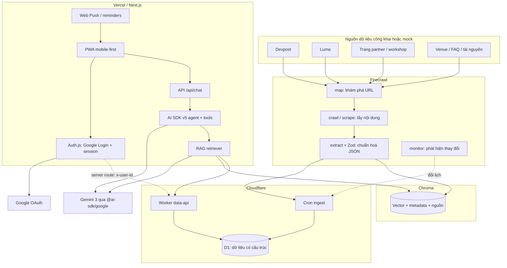
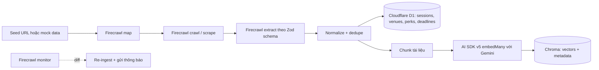
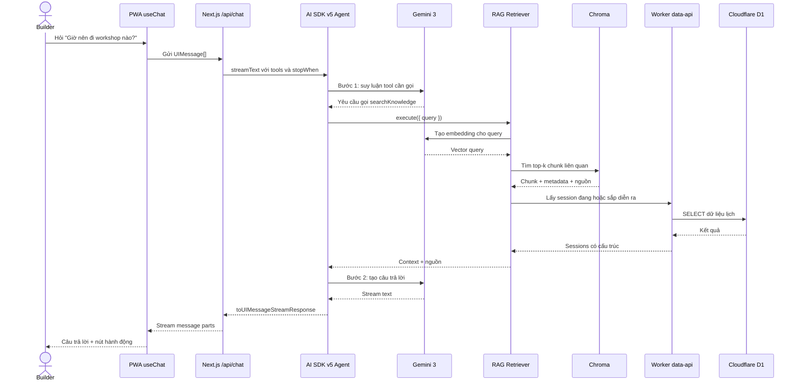
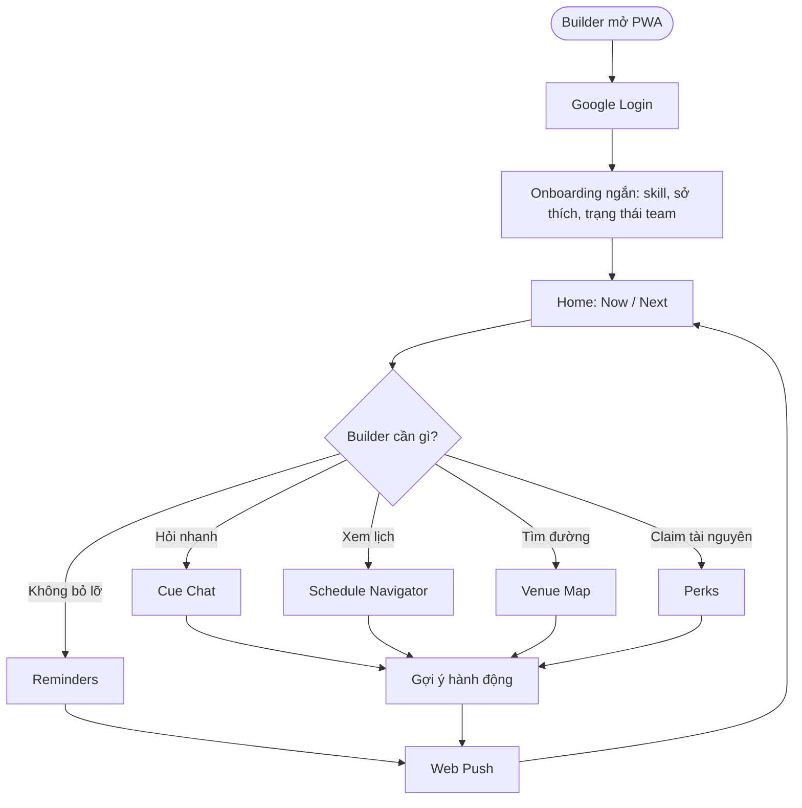
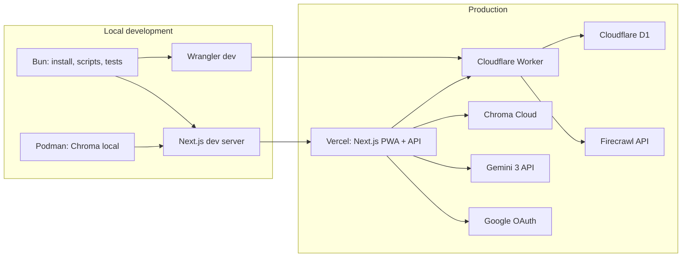
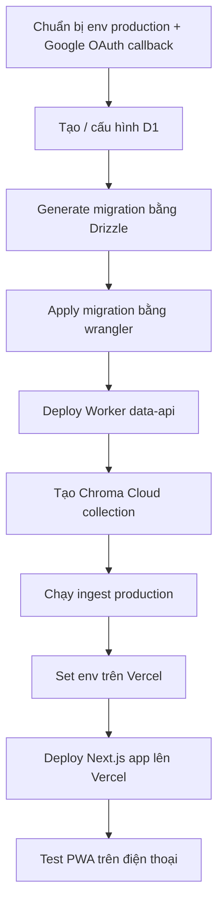
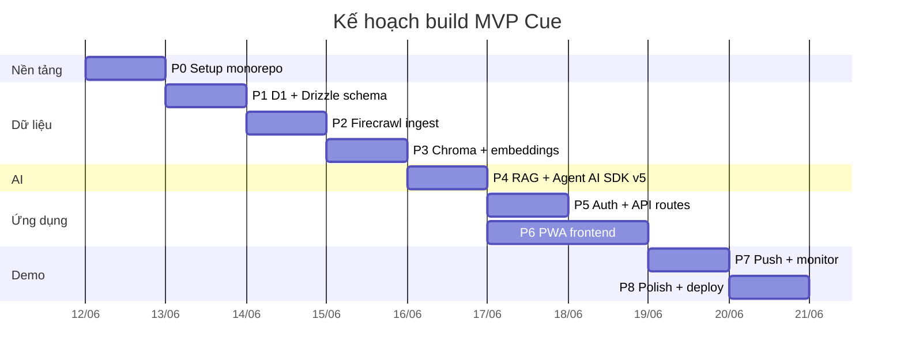

# Cue cho Agentic AI Build Week

Cue là bản kế hoạch sản phẩm và kiến trúc cho một PWA mobile-first phục vụ Builder Experience Award của Agentic AI Build Week. Mục tiêu là giúp builder trong sự kiện trả lời nhanh ba câu hỏi quan trọng: **đang có gì**, **ở đâu**, và **tôi nên làm gì tiếp**.

Dự án hiện ở giai đoạn **pre-implementation**. Repository đang chứa brief, build plan, và các file hướng dẫn agent theo từng thư mục. Chưa có source code, package manifest, hay git workspace config trong thư mục làm việc hiện tại.

## Tài liệu chính

| File | Vai trò |
|---|---|
| `Builder-Experience-Award-Brief.md` | Brief gốc của track Builder Experience Award |
| `new_features/` | PRD và spec theo từng feature |
| `AGENTS.md` | Hướng dẫn ngắn cho các phiên làm việc sau |
| `apps/*/AGENTS.md`, `workers/*/AGENTS.md`, `packages/*/AGENTS.md` | Quy ước riêng cho từng vùng trong monorepo dự kiến |

## Bài toán

Trong Agentic AI Build Week, builder phải xử lý nhiều thông tin cùng lúc: workshop nhiều địa điểm, lịch trình, teammate, deadline, perks, mentor, judging và di chuyển. Cue tập trung giải quyết sự lẫn lộn này bằng một trải nghiệm AI có hành động thật, không chỉ là chatbot hỏi đáp.

Các tình huống chính:

- Builder hỏi: "Bây giờ đang có gì gần tôi?"
- Builder hỏi: "Workshop tiếp theo phù hợp với AI infra là gì?"
- Builder cần chỉ đường tới venue.
- Builder muốn đặt nhắc nhở trước deadline hoặc workshop.
- Builder muốn tìm perk hoặc tài nguyên từ partner.
- Builder cần câu trả lời có nguồn, không bịa thông tin.

## Sản phẩm đề xuất

Cue là một PWA gồm các module:

| Module | Mục đích |
|---|---|
| Home Now/Next | Hiển thị việc đang diễn ra và việc sắp diễn ra |
| Google Login | Đăng nhập nhanh bằng Google để lưu profile, sở thích và nhắc nhở |
| Cue Chat | Hỏi đáp bằng AI, stream câu trả lời, gọi tool khi cần |
| Schedule Navigator | Lọc lịch theo ngày, track, partner, chủ đề |
| Venue Map | Xem địa điểm và mở chỉ đường |
| Perks | Xem tài nguyên, credits, benefits và cách claim |
| Reminders | Đặt nhắc nhở trước workshop, deadline, demo |

## Kiến trúc tổng quan



## Luồng dữ liệu ingest

Firecrawl chịu trách nhiệm lấy dữ liệu từ web hoặc mock source, sau đó chuẩn hoá thành dữ liệu có cấu trúc và dữ liệu vector.



## Luồng hỏi đáp Hybrid RAG + Agent

Chat không chỉ gửi prompt sang LLM. Agent dùng tool để truy xuất tri thức, tra lịch, tìm venue, đặt nhắc nhở và trả lời có nguồn.



## Hành trình người dùng



## Deployment topology



## Stack kỹ thuật

| Layer | Công nghệ | Ghi chú quan trọng |
|---|---|---|
| Toolchain | Bun | Dùng cho install, scripts, dev, test. Không dùng Bun runtime trên Vercel. |
| Web app | Next.js App Router | Deploy lên Vercel Node runtime. |
| UI | Tailwind CSS + shadcn/ui | Mobile-first, nhanh cho MVP. |
| PWA | Serwist | Service worker, manifest, offline cache lịch. |
| Auth | Auth.js / NextAuth.js v5 + Google Provider | Google Login trong Next.js App Router; MVP không thêm email/password. |
| AI framework | Vercel AI SDK v5 | Dùng `streamText`, `tool({ inputSchema })`, `stopWhen: stepCountIs(n)`, `useChat`. |
| LLM | Gemini 3 qua `@ai-sdk/google` | Model id để trong env vì preview có thể đổi. |
| Embeddings | Gemini embedding qua AI SDK | Ưu tiên `gemini-embedding-001`. |
| Structured DB | Cloudflare D1 | Dùng qua Worker Data API là hướng khuyến nghị. |
| ORM | Drizzle ORM | `drizzle-orm/d1` chỉ dùng trong Worker. |
| Vector DB | Chroma | Local bằng Podman, production dùng Chroma Cloud. |
| Ingest | Firecrawl | `map`, `crawl`, `scrape`, `extract`, `monitor`. |
| Validation | Zod | Schema dùng chung cho Firecrawl, tools, API. |
| Notifications | Web Push | Nhắc workshop, deadline, thay đổi lịch. |
| Local infra | Podman | Chỉ phục vụ local; không deploy container lên Vercel. |

## Cấu trúc monorepo dự kiến

```text
event-copilot/
├─ apps/
│  └─ web/                 # Next.js PWA + API routes, deploy Vercel
├─ workers/
│  └─ data-api/            # Cloudflare Worker + D1 + Drizzle + cron ingest
├─ packages/
│  ├─ core/                # Zod schemas, types, LLM/vector/D1 clients, RAG, tools
│  └─ ingest/              # Firecrawl pipeline
├─ infra/                  # Podman local Chroma và dev infra
├─ drizzle/                # D1 schema + migrations
├─ Builder-Experience-Award-Brief.md
├─ new_features/           # PRD và spec theo từng feature
└─ README.md
```

## Các nguyên tắc không được làm sai

| Nguyên tắc | Lý do |
|---|---|
| Bun là toolchain, không phải runtime production | Vercel Functions chạy Node/Edge, không chạy Bun server runtime. |
| Không dùng `drizzle-orm/d1` trong Next.js route | D1 binding chỉ tồn tại trong Cloudflare Worker. |
| Không lưu vector trong D1 | D1 lưu dữ liệu có cấu trúc; vector nằm trong Chroma. |
| Không gọi Worker trực tiếp từ client cho dữ liệu user | Next.js route phải xác thực `auth()`, rồi gọi Worker bằng `DATA_API_TOKEN` và `x-user-id`. |
| Không deploy Podman lên Vercel | Vercel build từ source, không nhận container app từ Podman. |
| Dùng AI SDK v5, không dùng API v4 | v5 đổi `tool({ inputSchema })`, `stopWhen`, `useChat`, `message.parts`. |
| RAG phải trích nguồn | Agent không được bịa lịch, venue, perk hoặc deadline. |
| Model Gemini để trong env | Gemini 3 đang preview; tên model có thể đổi. |

## Công cụ agent

Agent dự kiến có các tool sau:

| Tool | Vai trò |
|---|---|
| `searchKnowledge` | Tìm thông tin bằng RAG từ Chroma và nguồn có trích dẫn |
| `getNow` | Lấy việc đang diễn ra theo thời gian hiện tại |
| `getNext` | Lấy việc sắp diễn ra trong một khoảng thời gian |
| `findWorkshops` | Tìm workshop theo chủ đề, level, partner hoặc track |
| `getDirections` | Trả thông tin venue và link bản đồ |
| `listPerks` | Liệt kê perks hoặc tài nguyên có thể claim |
| `setReminder` | Đặt nhắc nhở trước workshop hoặc deadline |
| `getDeadlines` | Lấy các mốc nộp bài, demo, vote, judging |

## Data model chính

| Bảng | Dữ liệu |
|---|---|
| `users` | Profile Google tối thiểu, preferences, trạng thái onboarding |
| `sessions` | Workshop, meetup, kickoff, demo, hoạt động theo lịch |
| `venues` | Tên địa điểm, địa chỉ, tọa độ, link bản đồ |
| `perks` | Tài nguyên, credits, benefits, cách claim |
| `deadlines` | Mốc nộp bài, vote, demo, judging |
| `reminders` | Nhắc nhở user đã đặt |

Vector chunks nằm ở Chroma với metadata như `sourceUrl`, `kind`, `sessionId`, `venueId`, `updatedAt`.

## Biến môi trường

```bash
# Auth.js + Google Login
AUTH_SECRET=...
AUTH_GOOGLE_ID=...
AUTH_GOOGLE_SECRET=...
AUTH_URL=http://localhost:3000

# Firecrawl
FIRECRAWL_API_KEY=fc-...

# Gemini 3 qua @ai-sdk/google
GOOGLE_GENERATIVE_AI_API_KEY=...
GEMINI_CHAT_MODEL=gemini-3-pro-preview
GEMINI_EMBED_MODEL=gemini-embedding-001

# Chroma Cloud hoặc Chroma local
CHROMA_API_KEY=...
CHROMA_TENANT=...
CHROMA_DATABASE=aabw
CHROMA_HOST=localhost
CHROMA_PORT=8000

# Cloudflare D1 REST, nếu dùng Option B
CLOUDFLARE_ACCOUNT_ID=...
CLOUDFLARE_API_TOKEN=...
D1_DATABASE_ID=...

# Worker Data API, nếu dùng Option A
DATA_API_URL=https://data-api.<you>.workers.dev
DATA_API_TOKEN=...

# Web Push
VAPID_PUBLIC_KEY=...
VAPID_PRIVATE_KEY=...
VAPID_SUBJECT=mailto:you@example.com
```

Google OAuth callback cần khai báo trong Google Cloud Console: `https://<domain>/api/auth/callback/google` và local `http://localhost:3000/api/auth/callback/google`.

## Lệnh phát triển dự kiến

```bash
# Cài dependencies
bun install

# Chạy app Next.js trong apps/web
bun run dev

# Chạy Worker trong workers/data-api
wrangler dev

# Tạo migration Drizzle
bunx drizzle-kit generate

# Apply D1 migration local
wrangler d1 migrations apply aabw --local

# Chạy Chroma local bằng Podman
podman run -d --name chroma -p 8000:8000 docker.io/chromadb/chroma:latest

# Kiểm tra trước khi push
bunx biome check . && bunx tsc --noEmit && bun test
```

## Thứ tự deploy dự kiến



## Build phases



## Definition of Done cho submission

- Có live demo link.
- Có video demo ngắn giải thích pain, hỏi đáp, hành động và nhắc nhở.
- App chạy được bằng hướng dẫn rõ ràng.
- Google Login chạy được trên local và production; nhắc nhở/sở thích gắn đúng user.
- PWA dùng tốt trên điện thoại.
- Chat không chỉ là wrapper LLM, mà có RAG và agent tools.
- Câu trả lời có nguồn khi dùng dữ liệu sự kiện.
- Có mock data để demo ổn định nếu nguồn web bị chặn.

## Rủi ro chính

| Rủi ro | Cách xử lý |
|---|---|
| D1 REST bị rate limit | Dùng Worker Data API làm đường chính. |
| Gemini 3 đổi model id | Để model trong env và kiểm tra docs trước khi deploy. |
| Chroma không chạy trong serverless | Production dùng Chroma Cloud; local dùng Podman. |
| Firecrawl thiếu dữ liệu hoặc bị chặn | Duy trì mock data đúng schema. |
| LLM bịa thông tin | System prompt bắt buộc trích nguồn; thiếu dữ liệu thì nói rõ. |
| OAuth callback/env sai | Set `AUTH_URL`, Google callback `/api/auth/callback/google`, test local và Vercel preview. |
| Venue mạng yếu | PWA cache offline lịch và dữ liệu quan trọng. |

## Tài liệu sâu hơn

Đọc các tài liệu trong `new_features/` để xem chi tiết từng feature.
