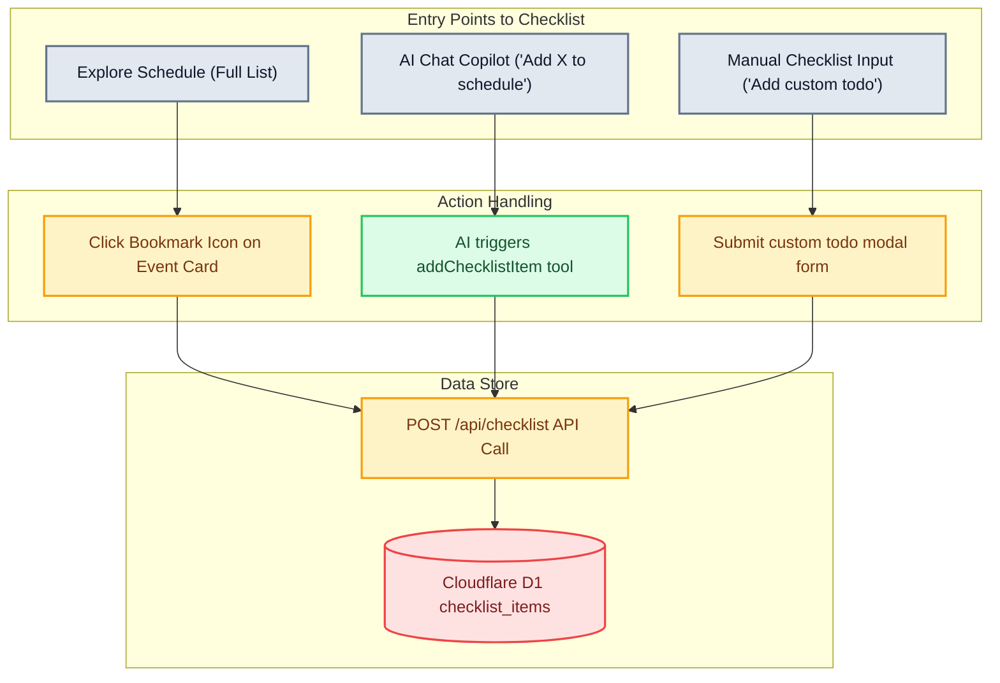
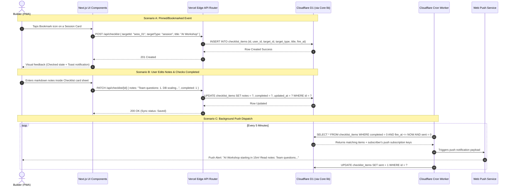

# Product Requirements Document (PRD) & Technical Spec: Event Checklist ("FOMO Killer")

This document serves as the absolute source of truth for the **Event Checklist & Personal Task Manager** feature (referred to as the "FOMO Killer"). It has been designed and audited from both **Business Analyst (BA)** and **Quality Assurance (QA)** perspectives to solve the central hackathon user pain: **cognitive overload and missing critical milestones**.

---

## 1. Product & UX Requirements (BA Perspective)

### 1.1 Core Problems Solved
1. **Information Overload:** With hundreds of sessions, workshops, deadlines, and perks, builders are overwhelmed.
2. **Missing Key Milestones:** Builders forget critical submission times or sponsor check-in deadlines.
3. **Siloed Notes:** Builders have no place to store workshop takeaways or team tasks directly linked to the event timeline.

### 1.2 Location & Placement in the App
The **Event Checklist** is integrated directly into the existing `/schedule` route to leverage the existing page framework and keep the app's bottom navigation bar uncluttered.
* **Segmented Toggle at the Top:** In the main header of the Schedule page, a segmented controller allows the user to switch modes:
  * **[Full Agenda]**: Displays the original day switcher (`DayTabs` Day 1–5) and all official events (`ScheduleList`).
  * **[My Checklist]**: Displays the user's personalized checklist containing saved events, custom tasks, and rich notes.
* **This design ensures:**
  1. No unnecessary nav tabs are added to the main `TabBar.tsx` layout.
  2. High context relevance: Users see "Schedule" and "Checklist" under the same conceptual view.

### 1.3 UI/UX Component Structure & Style
The design system complies with the existing **Tailwind CSS + shadcn/ui** framework, utilizing the glassmorphic dark theme.

```
+-------------------------------------------------------------+
| Agenda                                                      |
| Schedule                                                    |
|                                                             |
| +---------------------------------------------------------+ |
| |        Full Agenda        |       My Checklist (Active) | |  <-- Custom Segmented Control
| +---------------------------------------------------------+ |
|                                                             |
| [================== (80% Completed) ====================]   |  <-- Progress Bar
|                                                             |
| +---------------------------------------------------------+ |
| | [x] AI Pitching Workshop          14:00 - 15:30    [🗑️] | |  <-- Official Session Item
| |     Venue: Galaxy Innovation Park                       | |
| |     Notes: Focus on D1 + AI SDK integration details...   | |  <-- User Personal Notes
| +---------------------------------------------------------+ |
| +---------------------------------------------------------+ |
| | [ ] Submit Devpost Pitch Video   Due: 23:59 (Today) [🗑️] | |  <-- Custom Task Item
| |     Notes: Recording link: drive.google.com/xyz         | |
| +---------------------------------------------------------+ |
|                                                             |
|                             [ + Add Custom Todo Task ]      |  <-- Floating Action Button
+-------------------------------------------------------------+
```

#### Key Design Specs:
1. **Segmented Tabs Control:** A full-width `no-scrollbar` container with a glassmorphic border (`border-line bg-surface/80 p-1 backdrop-blur`). Active state uses `bg-accent text-accent-ink`.
2. **Progress indicator:** A custom `<Progress value={completionRate} />` at the top of the checklist showing `(Completed Items / Total Items) * 100` to gamify the builder experience.
3. **Checklist Cards:** Individual items rendered using `<Card>` from shadcn/ui:
   * Left side: An interactive `<Checkbox>` with checked items getting a styling modifier: `line-through opacity-50 transition-all duration-300`.
   * Center: Title, time label, location badge, and an expandable note indicator.
   * Right side: An action button group (`[🗑️ Delete]` and `[🔔 Reminder Alert]`).
4. **Rich Text / Notes Panel:** Tapping on a card opens a bottom drawer/sheet (`<Sheet>` from shadcn/ui) containing:
   * A detailed `<Textarea>` for typing personal notes.
   * Markdown preview capability.
   * **Auto-save mechanism:** Debounced at 500ms, pushing updates to the API automatically.
5. **Add Task Form:** A floating action button `[+ Add Custom Task]` trigger opens a Dialog modal with:
   * **Title Input:** Plain text.
   * **Time Picker:** Optional date/time setting to trigger a Push Notification.
   * **Notes/Description:** Preloaded blank textarea.

---

## 2. Mockup Reference (Visual System)

The following UI mockups illustrate the specific layout, styling, and flow.

:::carousel

*Figure 1: The "My Checklist" view. Bookmarked sessions appear in a clean timeline with a status progress bar and action buttons.*
<!-- slide -->

*Figure 2: Custom Todo & Notes Interface. Users can create custom tasks, track status, and expand items to write rich markdown notes.*
<!-- slide -->

*Figure 3: AI Chat Integration. The Event Copilot can add items directly to the checklist on behalf of the user using tool-calling.*
<!-- slide -->

*Figure 4: Automated Reminders. Web Push notification triggered prior to bookmarked session start times to prevent FOMO.*
:::

---

## 3. Data Integration & Event Sync Flow

To support both **official schedule items** (sessions, deadlines, perks) and **custom user items** in a unified UI, we merge them into a single, clean database model.

### 3.1 Database Schema Definition (`drizzle/schema.ts`)
Instead of separate bookmark and task tables requiring heavy client-side joins, a single unified `checklist_items` table is added to **Cloudflare D1**.

```typescript
import { sqliteTable, text, integer } from "drizzle-orm/sqlite-core";
import { users } from "./schema"; // Existing users table

export const checklistItems = sqliteTable("checklist_items", {
  id: text("id").primaryKey(),
  userId: text("user_id")
    .notNull()
    .references(() => users.id),
  
  // Core fields
  title: text("title").notNull(),          // Cached title for custom tasks or quick display
  notes: text("notes"),                    // Rich text/markdown notes written by the user
  completed: integer("completed")          // Boolean flag: 0 = pending, 1 = completed
    .notNull()
    .default(0),

  // Association with official data (Optional)
  targetId: text("target_id"),             // Nullable. Refers to sessions.id, deadlines.id, etc.
  targetType: text("target_type")          // Enum: 'session' | 'deadline' | 'perk' | 'custom'
    .notNull()
    .default("custom"),

  // Alert configuration
  fireAt: integer("fire_at"),              // Epoch ms indicating when push notification triggers
  sent: integer("sent").default(0),        // Web Push tracking status: 0 = queued, 1 = sent
  
  createdAt: integer("created_at").notNull(),
  updatedAt: integer("updated_at").notNull(),
});
```

### 3.2 Event Integration & Sync Mechanisms



#### Flow A: Adding from the Official Agenda
1. User clicks the bookmark icon (📌) on any session or deadline card.
2. The client fires `POST /api/checklist` with `targetId`, `targetType = "session"`, and `title = "Session Title"`.
3. The API handles deduplication: if `targetId` already exists for the user, it ignores the request; otherwise, it creates a new row.
4. UI triggers a toast notification: *"Saved to Checklist!"*.

#### Flow B: Adding via AI Chat (Gemini 3.5 tool call)
1. User types in chat: *"Nhắc tôi tham gia workshop Demo Day lúc 3h chiều"* (Remind me to join Demo Day workshop at 3 PM).
2. The model uses the Vercel AI SDK v5 tool `addChecklistItem` passing the matched `targetId`, `targetType`, and computed alert time.
3. The server runs the tool code, inserts it into D1, and replies: *"Đã lưu Workshop Demo Day vào Checklist của bạn!"*.

---

## 4. Technical Architecture (Sequence Diagram)

This diagram shows the end-to-end interactions between the client, Vercel APIs, the D1 database, and the background push notification engine.



---

## 5. QA Verification Matrix (QA Perspective)

The QA team will verify the features against this matrix. Automation tests will verify API contracts while manual runs verify UI and offline behaviors.

| Test ID | Area | Scenario / Action | Expected Result | Verification Type |
| :--- | :--- | :--- | :--- | :--- |
| **TC-01** | Navigation | Click segmented toggle `[My Checklist]` | Interface switches smoothly from schedule to checklist view. Progress bar displays current completion percentage. | Manual (Browser/PWA) |
| **TC-02** | Data Sync | Bookmark a session from Full Agenda | Item immediately appears in `[My Checklist]`. Switched state shows selected state in general view. D1 contains corresponding `checklist_items` row. | Integration / API |
| **TC-03** | Custom Tasks | Click `[+ Add Custom Task]`, fill in details, and submit | Card appears in Checklist. Database shows `target_type = "custom"`, `target_id = null`. | E2E (Playwright) |
| **TC-04** | Note Persistence | Write text in the note sheet, close it, and reload page | The text persists. Network tab reveals debounced `PATCH` requests firing with HTTP 200. | Manual / API |
| **TC-05** | Completion State | Toggle the checkbox of a checklist item | Card style updates to `line-through opacity-50`. Completion progress bar increases. Database state changes to `completed = 1`. | E2E (Playwright) |
| **TC-06** | AI Integration | In Chat: "Add Devpost submission deadline to my plan" | AI model invokes `addChecklistItem` tool. Response reports success. Item is added to checklist with `target_type = "deadline"`. | Integration (LLM test) |
| **TC-07** | Offline Support | Toggle Offline Mode in DevTools and interact with Checklist | PWA handles offline gracefully via service worker caching. Notes are saved to IndexedDB and synchronized once connection returns. | Manual (Chrome DevTools)|
| **TC-08** | Reminders | Set alert time to 1 min in future | System triggers Service Worker push notification when time expires. Push displays Title and notes preview. | Manual / Cron Test |

---

## 6. Technical Implementation Plan

### Phase 1: Database Migration
1. Add the `checklistItems` schema to `drizzle/schema.ts`.
2. Generate migrations using `bunx drizzle-kit generate`.
3. Apply locally: `wrangler d1 migrations apply aabw --local`.

### Phase 2: API Endpoints (Next.js Edge Router)
Create `apps/web/app/api/checklist/route.ts` and `/api/checklist/[id]/route.ts`:
* `GET /api/checklist`: Returns a merged array of user tasks and associated session metadata.
* `POST /api/checklist`: Inserts a new bookmark or custom task.
* `PATCH /api/checklist/[id]`: Updates details (`notes`, `completed`, `title`, `fireAt`).
* `DELETE /api/checklist/[id]`: Deletes the checklist item.

### Phase 3: Frontend Layout & UI Integration
1. Update `apps/web/app/schedule/page.tsx` to host the segmented toggle.
2. Build the `ChecklistDashboard` component displaying the progress bar, checked cards, and note-taking panels.
3. Hook inputs to react-query `useMutation` for real-time saving and instant query invalidation.
4. Bind bookmark buttons on `SessionCard` and `ToolCard` (AI) to trigger `POST /api/checklist`.

### Phase 4: Cron & Push Notifications Integration
1. Update the background Cloudflare Cron Worker to query D1's `checklist_items` table for due notifications.
2. Link the notifications to trigger the browser Service Worker.
